# Face Generation
In this project, you'll use generative adversarial networks to generate new images of faces.
### Get the Data
You'll be using two datasets in this project:
- MNIST
- CelebA

Since the celebA dataset is complex and you're doing GANs in a project for the first time, we want you to test your neural network on MNIST before CelebA.  Running the GANs on MNIST will allow you to see how well your model trains sooner.

If you're using [FloydHub](https://www.floydhub.com/), set `data_dir` to "/input" and use the [FloydHub data ID](http://docs.floydhub.com/home/using_datasets/) "R5KrjnANiKVhLWAkpXhNBe".


```python
data_dir = './data'

# FloydHub - Use with data ID "R5KrjnANiKVhLWAkpXhNBe"
#data_dir = '/input'


"""
DON'T MODIFY ANYTHING IN THIS CELL
"""
import helper

helper.download_extract('mnist', data_dir)
helper.download_extract('celeba', data_dir)
```

    Found mnist Data
    Found celeba Data


## Explore the Data
### MNIST
As you're aware, the [MNIST](http://yann.lecun.com/exdb/mnist/) dataset contains images of handwritten digits. You can view the first number of examples by changing `show_n_images`. 


```python
show_n_images = 25

"""
DON'T MODIFY ANYTHING IN THIS CELL
"""
%matplotlib inline
import os
from glob import glob
from matplotlib import pyplot

mnist_images = helper.get_batch(glob(os.path.join(data_dir, 'mnist/*.jpg'))[:show_n_images], 28, 28, 'L')
pyplot.imshow(helper.images_square_grid(mnist_images, 'L'), cmap='gray')
```


    <matplotlib.image.AxesImage at 0x7fed31200da0>


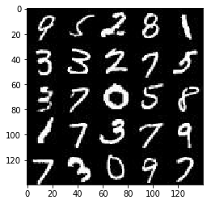


### CelebA
The [CelebFaces Attributes Dataset (CelebA)](http://mmlab.ie.cuhk.edu.hk/projects/CelebA.html) dataset contains over 200,000 celebrity images with annotations.  Since you're going to be generating faces, you won't need the annotations.  You can view the first number of examples by changing `show_n_images`.


```python
show_n_images = 25

"""
DON'T MODIFY ANYTHING IN THIS CELL
"""
mnist_images = helper.get_batch(glob(os.path.join(data_dir, 'img_align_celeba/*.jpg'))[:show_n_images], 28, 28, 'RGB')
pyplot.imshow(helper.images_square_grid(mnist_images, 'RGB'))
```


    <matplotlib.image.AxesImage at 0x7fed31130160>


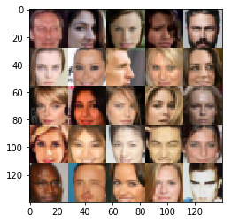


## Preprocess the Data
Since the project's main focus is on building the GANs, we'll preprocess the data for you.  The values of the MNIST and CelebA dataset will be in the range of -0.5 to 0.5 of 28x28 dimensional images.  The CelebA images will be cropped to remove parts of the image that don't include a face, then resized down to 28x28.

The MNIST images are black and white images with a single [color channel](https://en.wikipedia.org/wiki/Channel_(digital_image%29) while the CelebA images have [3 color channels (RGB color channel)](https://en.wikipedia.org/wiki/Channel_(digital_image%29#RGB_Images).
## Build the Neural Network
You'll build the components necessary to build a GANs by implementing the following functions below:
- `model_inputs`
- `discriminator`
- `generator`
- `model_loss`
- `model_opt`
- `train`

### Check the Version of TensorFlow and Access to GPU
This will check to make sure you have the correct version of TensorFlow and access to a GPU


```python
"""
DON'T MODIFY ANYTHING IN THIS CELL
"""
from distutils.version import LooseVersion
import warnings
import tensorflow as tf

# Check TensorFlow Version
assert LooseVersion(tf.__version__) >= LooseVersion('1.0'), 'Please use TensorFlow version 1.0 or newer.  You are using {}'.format(tf.__version__)
print('TensorFlow Version: {}'.format(tf.__version__))

# Check for a GPU
if not tf.test.gpu_device_name():
    warnings.warn('No GPU found. Please use a GPU to train your neural network.')
else:
    print('Default GPU Device: {}'.format(tf.test.gpu_device_name()))
```

    TensorFlow Version: 1.8.0
    Default GPU Device: /device:GPU:0


### Input
Implement the `model_inputs` function to create TF Placeholders for the Neural Network. It should create the following placeholders:
- Real input images placeholder with rank 4 using `image_width`, `image_height`, and `image_channels`.
- Z input placeholder with rank 2 using `z_dim`.
- Learning rate placeholder with rank 0.

Return the placeholders in the following the tuple (tensor of real input images, tensor of z data)


```python
import problem_unittests as tests

def model_inputs(image_width, image_height, image_channels, z_dim):
    """
    Create the model inputs
    :param image_width: The input image width
    :param image_height: The input image height
    :param image_channels: The number of image channels
    :param z_dim: The dimension of Z
    :return: Tuple of (tensor of real input images, tensor of z data, learning rate)
    """
    # TODO: Implement Function
    inputs_real = tf.placeholder(tf.float32, (None, image_width, image_height, image_channels), name='input_real')
    inputs_z = tf.placeholder(tf.float32, (None, z_dim), name='input_z')
    learning_rate = tf.placeholder(tf.float32, name='learning_rate')

    return inputs_real, inputs_z, learning_rate


"""
DON'T MODIFY ANYTHING IN THIS CELL THAT IS BELOW THIS LINE
"""
tests.test_model_inputs(model_inputs)
```

    Tests Passed


### Discriminator
Implement `discriminator` to create a discriminator neural network that discriminates on `images`.  This function should be able to reuse the variables in the neural network.  Use [`tf.variable_scope`](https://www.tensorflow.org/api_docs/python/tf/variable_scope) with a scope name of "discriminator" to allow the variables to be reused.  The function should return a tuple of (tensor output of the discriminator, tensor logits of the discriminator).


```python
def discriminator(images, reuse=False):
    """
    Create the discriminator network
    :param images: Tensor of input image(s)
    :param reuse: Boolean if the weights should be reused
    :return: Tuple of (tensor output of the discriminator, tensor logits of the discriminator)
    """
    
    alpha = 0.2
    
    # TODO: Implement Function
    with tf.variable_scope('discriminator', reuse=reuse):
        # Input layer is 32x32x3
        x1 = tf.layers.conv2d(images, 64, 5, strides=2, padding='same')
        # Leaky ReLU
        relu1 = tf.maximum(alpha * x1, x1)
        # 16x16x64
        
        x2 = tf.layers.conv2d(relu1, 128, 5, strides=2, padding='same')
        bn2 = tf.layers.batch_normalization(x2, training=True)
        relu2 = tf.maximum(alpha * bn2, bn2)
        # 8x8x128
        
        x3 = tf.layers.conv2d(relu2, 256, 5, strides=2, padding='same')
        bn3 = tf.layers.batch_normalization(x3, training=True)
        relu3 = tf.maximum(alpha * bn3, bn3)
        # 4x4x256

        # Flatten it
        flat = tf.reshape(relu3, (-1, 4*4*256))
        logits = tf.layers.dense(flat, 1)
        out = tf.sigmoid(logits)
        
        return out, logits


"""
DON'T MODIFY ANYTHING IN THIS CELL THAT IS BELOW THIS LINE
"""
tests.test_discriminator(discriminator, tf)
```

    Tests Passed


### Generator
Implement `generator` to generate an image using `z`. This function should be able to reuse the variables in the neural network.  Use [`tf.variable_scope`](https://www.tensorflow.org/api_docs/python/tf/variable_scope) with a scope name of "generator" to allow the variables to be reused. The function should return the generated 28 x 28 x `out_channel_dim` images.


```python
def generator(z, out_channel_dim, is_train=True):
    """
    Create the generator network
    :param z: Input z
    :param out_channel_dim: The number of channels in the output image
    :param is_train: Boolean if generator is being used for training
    :return: The tensor output of the generator
    """
    
    alpha = 0.2
    
    with tf.variable_scope('generator', reuse= not is_train):
        # First fully connected layer
        x1 = tf.layers.dense(z, 4*4*512)
#         print(x1.get_shape())
        # Reshape it to start the convolutional stack
        x1 = tf.reshape(x1, (-1, 4, 4, 512))
        x1 = tf.layers.batch_normalization(x1, training=is_train)
        x1 = tf.maximum(alpha * x1, x1)
#         print(x1.get_shape())
        
        x2 = tf.layers.conv2d_transpose(x1, 256, 5, strides=2, padding='same')
        x2 = tf.layers.batch_normalization(x2, training=is_train)
        x2 = tf.maximum(alpha * x2, x2)
#         print(x2.get_shape())
        
        x3 = tf.layers.conv2d_transpose(x2, 128, 5, strides=2, padding='same')
        x3 = tf.layers.batch_normalization(x3, training=is_train)
        x3 = tf.maximum(alpha * x3, x3)
#         print(x3.get_shape())
        # 16x16x128 now
        
        # Output layer
        logits = tf.layers.conv2d_transpose(x3, out_channel_dim, 5, strides=2, padding='same')
#         print(logits.get_shape())
        
        logits = tf.image.resize_images(logits, (28, 28))
        # 28 x 28 x out_channel_dim now

        out = tf.tanh(logits)
    return out


"""
DON'T MODIFY ANYTHING IN THIS CELL THAT IS BELOW THIS LINE
"""
tests.test_generator(generator, tf)
```

    Tests Passed


### Loss
Implement `model_loss` to build the GANs for training and calculate the loss.  The function should return a tuple of (discriminator loss, generator loss).  Use the following functions you implemented:
- `discriminator(images, reuse=False)`
- `generator(z, out_channel_dim, is_train=True)`


```python
def model_loss(input_real, input_z, out_channel_dim):
    """
    Get the loss for the discriminator and generator
    :param input_real: Images from the real dataset
    :param input_z: Z input
    :param out_channel_dim: The number of channels in the output image
    :return: A tuple of (discriminator loss, generator loss)
    """
    # TODO: Implement Function
    
    g_model = generator(input_z, out_channel_dim)
    d_model_real, d_logits_real = discriminator(input_real)
    d_model_fake, d_logits_fake = discriminator(g_model, reuse=True)

    d_loss_real = tf.reduce_mean(
        tf.nn.sigmoid_cross_entropy_with_logits(logits=d_logits_real, labels=tf.ones_like(d_model_real)))
    d_loss_fake = tf.reduce_mean(
        tf.nn.sigmoid_cross_entropy_with_logits(logits=d_logits_fake, labels=tf.zeros_like(d_model_fake)))
    g_loss = tf.reduce_mean(
        tf.nn.sigmoid_cross_entropy_with_logits(logits=d_logits_fake, labels=tf.ones_like(d_model_fake)))

    d_loss = d_loss_real + d_loss_fake

    return d_loss, g_loss
    


"""
DON'T MODIFY ANYTHING IN THIS CELL THAT IS BELOW THIS LINE
"""
tests.test_model_loss(model_loss)
```

    Tests Passed


### Optimization
Implement `model_opt` to create the optimization operations for the GANs. Use [`tf.trainable_variables`](https://www.tensorflow.org/api_docs/python/tf/trainable_variables) to get all the trainable variables.  Filter the variables with names that are in the discriminator and generator scope names.  The function should return a tuple of (discriminator training operation, generator training operation).


```python
def model_opt(d_loss, g_loss, learning_rate, beta1):
    """
    Get optimization operations
    :param d_loss: Discriminator loss Tensor
    :param g_loss: Generator loss Tensor
    :param learning_rate: Learning Rate Placeholder
    :param beta1: The exponential decay rate for the 1st moment in the optimizer
    :return: A tuple of (discriminator training operation, generator training operation)
    """
    # TODO: Implement Function
    # Get weights and bias to update
    t_vars = tf.trainable_variables()
    d_vars = [var for var in t_vars if var.name.startswith('discriminator')]
    g_vars = [var for var in t_vars if var.name.startswith('generator')]

    # Optimize
    with tf.control_dependencies(tf.get_collection(tf.GraphKeys.UPDATE_OPS)):
        d_train_opt = tf.train.AdamOptimizer(learning_rate, beta1=beta1).minimize(d_loss, var_list=d_vars)
        g_train_opt = tf.train.AdamOptimizer(learning_rate, beta1=beta1).minimize(g_loss, var_list=g_vars)
    
    return d_train_opt, g_train_opt


"""
DON'T MODIFY ANYTHING IN THIS CELL THAT IS BELOW THIS LINE
"""
tests.test_model_opt(model_opt, tf)
```

    Tests Passed


## Neural Network Training
### Show Output
Use this function to show the current output of the generator during training. It will help you determine how well the GANs is training.


```python
"""
DON'T MODIFY ANYTHING IN THIS CELL
"""
import numpy as np

def show_generator_output(sess, n_images, input_z, out_channel_dim, image_mode):
    """
    Show example output for the generator
    :param sess: TensorFlow session
    :param n_images: Number of Images to display
    :param input_z: Input Z Tensor
    :param out_channel_dim: The number of channels in the output image
    :param image_mode: The mode to use for images ("RGB" or "L")
    """
    cmap = None if image_mode == 'RGB' else 'gray'
    z_dim = input_z.get_shape().as_list()[-1]
    example_z = np.random.uniform(-1, 1, size=[n_images, z_dim])

    samples = sess.run(
        generator(input_z, out_channel_dim, False),
        feed_dict={input_z: example_z})

    images_grid = helper.images_square_grid(samples, image_mode)
    pyplot.imshow(images_grid, cmap=cmap)
    pyplot.show()
```

### Train
Implement `train` to build and train the GANs.  Use the following functions you implemented:
- `model_inputs(image_width, image_height, image_channels, z_dim)`
- `model_loss(input_real, input_z, out_channel_dim)`
- `model_opt(d_loss, g_loss, learning_rate, beta1)`

Use the `show_generator_output` to show `generator` output while you train. Running `show_generator_output` for every batch will drastically increase training time and increase the size of the notebook.  It's recommended to print the `generator` output every 100 batches.


```python
%matplotlib inline
from matplotlib import pyplot as plt

def plot(loss_d, loss_g):
    fig, ax = plt.subplots()
    plt.plot(loss_d, label='Discriminator', alpha=0.5)
    plt.plot(loss_g, label='Generator', alpha=0.5)
    plt.title("Training Losses")
    plt.legend()
```


```python
def train(epoch_count, batch_size, z_dim, learning_rate, beta1, get_batches, data_shape, data_image_mode):
    """
    Train the GAN
    :param epoch_count: Number of epochs
    :param batch_size: Batch Size
    :param z_dim: Z dimension
    :param learning_rate: Learning Rate
    :param beta1: The exponential decay rate for the 1st moment in the optimizer
    :param get_batches: Function to get batches
    :param data_shape: Shape of the data
    :param data_image_mode: The image mode to use for images ("RGB" or "L")
    """
    
    print_every = 10
    show_every = 200

    out_channel_dim = data_shape[3]
        
    input_real, input_z, lr = model_inputs(data_shape[1], data_shape[2], data_shape[3], z_dim)
    d_loss, g_loss = model_loss(input_real, input_z, out_channel_dim)
    d_opt, g_opt = model_opt(d_loss, g_loss, learning_rate, beta1)
    
    loss_d, loss_g = [], []
    steps = 0
    
    
    with tf.Session() as sess:
        sess.run(tf.global_variables_initializer())
        for epoch_i in range(epoch_count):
            for batch_images in get_batches(batch_size):
                
                steps += 1

                # Sample random noise for G
                batch_z = np.random.uniform(-1, 1, size=(batch_size, z_dim))

                # Run optimizers
                _ = sess.run(d_opt, feed_dict={input_real: batch_images, input_z: batch_z, lr: learning_rate})
                _ = sess.run(g_opt, feed_dict={input_z: batch_z, input_real: batch_images, lr: learning_rate})

                if steps % print_every == 0:
                    # At the end of each epoch, get the losses and print them out
                    train_loss_d = d_loss.eval({input_z: batch_z, input_real: batch_images})
                    train_loss_g = g_loss.eval({input_z: batch_z})

                    print("Epoch {}/{}...".format(epoch_i + 1, epoch_count),
                          "Discriminator Loss: {:.4f}...".format(train_loss_d),
                          "Generator Loss: {:.4f}".format(train_loss_g))
                    # Save losses to view after training
                    loss_d.append(train_loss_d)
                    loss_g.append(train_loss_g)

                if steps % show_every == 0:
                    show_generator_output(sess, 16, input_z, out_channel_dim, data_image_mode)
                
            
        print("Final Output:")
        show_generator_output(sess, 16, input_z, out_channel_dim, data_image_mode)
        plot(loss_d, loss_g)
                
```

### MNIST
Test your GANs architecture on MNIST.  After 2 epochs, the GANs should be able to generate images that look like handwritten digits.  Make sure the loss of the generator is lower than the loss of the discriminator or close to 0.


```python
batch_size = 64
z_dim = 100
learning_rate = 0.0002
beta1 = 0.5

"""
DON'T MODIFY ANYTHING IN THIS CELL THAT IS BELOW THIS LINE
"""
epochs = 2

mnist_dataset = helper.Dataset('mnist', glob(os.path.join(data_dir, 'mnist/*.jpg')))
with tf.Graph().as_default():
    train(epochs, batch_size, z_dim, learning_rate, beta1, mnist_dataset.get_batches,
          mnist_dataset.shape, mnist_dataset.image_mode)
```

    Epoch 1/2... Discriminator Loss: 0.5915... Generator Loss: 0.9488
    Epoch 1/2... Discriminator Loss: 0.0876... Generator Loss: 2.9111
    Epoch 1/2... Discriminator Loss: 0.2672... Generator Loss: 2.4697
    Epoch 1/2... Discriminator Loss: 1.7181... Generator Loss: 0.2697
    Epoch 1/2... Discriminator Loss: 1.8014... Generator Loss: 0.5260
    Epoch 1/2... Discriminator Loss: 0.9364... Generator Loss: 1.2940
    Epoch 1/2... Discriminator Loss: 0.6079... Generator Loss: 1.4101
    Epoch 1/2... Discriminator Loss: 0.6476... Generator Loss: 1.1828
    Epoch 1/2... Discriminator Loss: 0.2332... Generator Loss: 2.5714
    Epoch 1/2... Discriminator Loss: 0.1087... Generator Loss: 3.7757
    Epoch 1/2... Discriminator Loss: 0.5308... Generator Loss: 1.3480
    Epoch 1/2... Discriminator Loss: 0.2400... Generator Loss: 2.4156
    Epoch 1/2... Discriminator Loss: 0.2849... Generator Loss: 2.5378
    Epoch 1/2... Discriminator Loss: 0.3008... Generator Loss: 2.0338
    Epoch 1/2... Discriminator Loss: 0.5095... Generator Loss: 3.6128
    Epoch 1/2... Discriminator Loss: 1.9109... Generator Loss: 0.2964
    Epoch 1/2... Discriminator Loss: 0.2944... Generator Loss: 2.5232
    Epoch 1/2... Discriminator Loss: 0.2175... Generator Loss: 2.2966
    Epoch 1/2... Discriminator Loss: 0.2775... Generator Loss: 1.7796
    Epoch 1/2... Discriminator Loss: 0.2079... Generator Loss: 2.4245


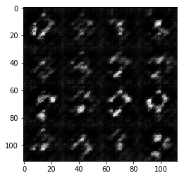


    Epoch 1/2... Discriminator Loss: 0.1317... Generator Loss: 3.9220
    Epoch 1/2... Discriminator Loss: 0.1460... Generator Loss: 2.4445
    Epoch 1/2... Discriminator Loss: 0.1442... Generator Loss: 3.0254
    Epoch 1/2... Discriminator Loss: 0.2209... Generator Loss: 2.8932
    Epoch 1/2... Discriminator Loss: 0.3933... Generator Loss: 6.2016
    Epoch 1/2... Discriminator Loss: 0.7039... Generator Loss: 0.8927
    Epoch 1/2... Discriminator Loss: 3.9853... Generator Loss: 0.0255
    Epoch 1/2... Discriminator Loss: 1.4584... Generator Loss: 2.1645
    Epoch 1/2... Discriminator Loss: 0.6998... Generator Loss: 1.9166
    Epoch 1/2... Discriminator Loss: 0.9997... Generator Loss: 0.7770
    Epoch 1/2... Discriminator Loss: 0.5755... Generator Loss: 1.2655
    Epoch 1/2... Discriminator Loss: 0.7333... Generator Loss: 3.2035
    Epoch 1/2... Discriminator Loss: 0.6930... Generator Loss: 0.8797
    Epoch 1/2... Discriminator Loss: 0.5057... Generator Loss: 2.4542
    Epoch 1/2... Discriminator Loss: 0.5781... Generator Loss: 1.1267
    Epoch 1/2... Discriminator Loss: 1.0548... Generator Loss: 3.6869
    Epoch 1/2... Discriminator Loss: 0.4532... Generator Loss: 1.6517
    Epoch 1/2... Discriminator Loss: 0.9824... Generator Loss: 4.5467
    Epoch 1/2... Discriminator Loss: 0.5868... Generator Loss: 2.7869
    Epoch 1/2... Discriminator Loss: 0.4238... Generator Loss: 1.9975


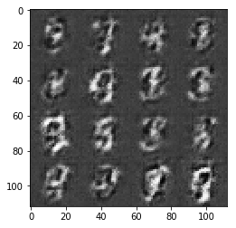


    Epoch 1/2... Discriminator Loss: 0.3490... Generator Loss: 1.7868
    Epoch 1/2... Discriminator Loss: 0.4239... Generator Loss: 2.2434
    Epoch 1/2... Discriminator Loss: 0.4198... Generator Loss: 1.6020
    Epoch 1/2... Discriminator Loss: 0.4376... Generator Loss: 1.5507
    Epoch 1/2... Discriminator Loss: 0.3424... Generator Loss: 1.6229
    Epoch 1/2... Discriminator Loss: 0.2945... Generator Loss: 2.2830
    Epoch 1/2... Discriminator Loss: 0.3590... Generator Loss: 2.0649
    Epoch 1/2... Discriminator Loss: 0.3593... Generator Loss: 1.8542
    Epoch 1/2... Discriminator Loss: 0.6484... Generator Loss: 0.9196
    Epoch 1/2... Discriminator Loss: 0.3905... Generator Loss: 1.5460
    Epoch 1/2... Discriminator Loss: 0.4054... Generator Loss: 1.3744
    Epoch 1/2... Discriminator Loss: 0.2585... Generator Loss: 2.0168
    Epoch 1/2... Discriminator Loss: 0.7320... Generator Loss: 0.9987
    Epoch 1/2... Discriminator Loss: 0.3691... Generator Loss: 1.4530
    Epoch 1/2... Discriminator Loss: 0.2590... Generator Loss: 1.9942
    Epoch 1/2... Discriminator Loss: 0.2534... Generator Loss: 1.9512
    Epoch 1/2... Discriminator Loss: 0.1996... Generator Loss: 2.2760
    Epoch 1/2... Discriminator Loss: 0.2451... Generator Loss: 2.5467
    Epoch 1/2... Discriminator Loss: 0.2113... Generator Loss: 2.4247
    Epoch 1/2... Discriminator Loss: 0.2656... Generator Loss: 1.9206


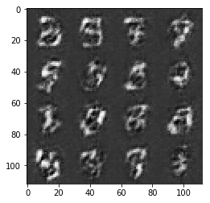


    Epoch 1/2... Discriminator Loss: 0.2687... Generator Loss: 1.8767
    Epoch 1/2... Discriminator Loss: 0.2099... Generator Loss: 2.1705
    Epoch 1/2... Discriminator Loss: 0.3033... Generator Loss: 1.7249
    Epoch 1/2... Discriminator Loss: 0.2918... Generator Loss: 1.6478
    Epoch 1/2... Discriminator Loss: 0.5787... Generator Loss: 1.6421
    Epoch 1/2... Discriminator Loss: 0.2964... Generator Loss: 2.0211
    Epoch 1/2... Discriminator Loss: 0.2639... Generator Loss: 2.0104
    Epoch 1/2... Discriminator Loss: 0.2690... Generator Loss: 2.1421
    Epoch 1/2... Discriminator Loss: 0.1898... Generator Loss: 2.2476
    Epoch 1/2... Discriminator Loss: 0.2667... Generator Loss: 1.9807
    Epoch 1/2... Discriminator Loss: 0.3460... Generator Loss: 1.5714
    Epoch 1/2... Discriminator Loss: 0.1754... Generator Loss: 2.5931
    Epoch 1/2... Discriminator Loss: 0.1735... Generator Loss: 2.2908
    Epoch 1/2... Discriminator Loss: 0.1989... Generator Loss: 2.2592
    Epoch 1/2... Discriminator Loss: 0.2085... Generator Loss: 2.0798
    Epoch 1/2... Discriminator Loss: 0.8079... Generator Loss: 6.7457
    Epoch 1/2... Discriminator Loss: 0.3083... Generator Loss: 1.6931
    Epoch 1/2... Discriminator Loss: 0.1073... Generator Loss: 2.9292
    Epoch 1/2... Discriminator Loss: 0.1532... Generator Loss: 2.6570
    Epoch 1/2... Discriminator Loss: 0.1233... Generator Loss: 2.8754


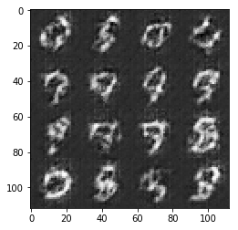


    Epoch 1/2... Discriminator Loss: 0.1176... Generator Loss: 2.9704
    Epoch 1/2... Discriminator Loss: 0.0746... Generator Loss: 3.7145
    Epoch 1/2... Discriminator Loss: 0.1150... Generator Loss: 2.9686
    Epoch 1/2... Discriminator Loss: 0.1932... Generator Loss: 2.1179
    Epoch 1/2... Discriminator Loss: 0.0887... Generator Loss: 3.7278
    Epoch 1/2... Discriminator Loss: 0.1841... Generator Loss: 2.1779
    Epoch 1/2... Discriminator Loss: 0.4537... Generator Loss: 1.6252
    Epoch 1/2... Discriminator Loss: 0.3063... Generator Loss: 2.0918
    Epoch 1/2... Discriminator Loss: 0.4474... Generator Loss: 1.3654
    Epoch 1/2... Discriminator Loss: 0.2556... Generator Loss: 1.8762
    Epoch 1/2... Discriminator Loss: 0.1695... Generator Loss: 2.3492
    Epoch 1/2... Discriminator Loss: 0.1495... Generator Loss: 2.6915
    Epoch 1/2... Discriminator Loss: 0.1762... Generator Loss: 2.2457
    Epoch 2/2... Discriminator Loss: 0.1870... Generator Loss: 2.3434
    Epoch 2/2... Discriminator Loss: 0.1867... Generator Loss: 2.3991
    Epoch 2/2... Discriminator Loss: 0.1708... Generator Loss: 2.4238
    Epoch 2/2... Discriminator Loss: 0.3189... Generator Loss: 1.5862
    Epoch 2/2... Discriminator Loss: 0.1455... Generator Loss: 2.5370
    Epoch 2/2... Discriminator Loss: 0.0833... Generator Loss: 3.4467
    Epoch 2/2... Discriminator Loss: 0.9990... Generator Loss: 2.4255


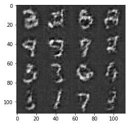


    Epoch 2/2... Discriminator Loss: 0.8364... Generator Loss: 1.0484
    Epoch 2/2... Discriminator Loss: 1.0291... Generator Loss: 1.1047
    Epoch 2/2... Discriminator Loss: 0.7746... Generator Loss: 1.4075
    Epoch 2/2... Discriminator Loss: 0.9989... Generator Loss: 2.2621
    Epoch 2/2... Discriminator Loss: 0.9178... Generator Loss: 0.6241
    Epoch 2/2... Discriminator Loss: 0.7239... Generator Loss: 0.9018
    Epoch 2/2... Discriminator Loss: 0.6965... Generator Loss: 0.8816
    Epoch 2/2... Discriminator Loss: 0.8177... Generator Loss: 0.7398
    Epoch 2/2... Discriminator Loss: 0.4349... Generator Loss: 1.4188
    Epoch 2/2... Discriminator Loss: 0.4288... Generator Loss: 1.3910
    Epoch 2/2... Discriminator Loss: 0.5111... Generator Loss: 1.2389
    Epoch 2/2... Discriminator Loss: 0.2393... Generator Loss: 2.0866
    Epoch 2/2... Discriminator Loss: 0.1488... Generator Loss: 2.5383
    Epoch 2/2... Discriminator Loss: 0.2378... Generator Loss: 1.9408
    Epoch 2/2... Discriminator Loss: 0.1425... Generator Loss: 3.2792
    Epoch 2/2... Discriminator Loss: 0.2347... Generator Loss: 1.7883
    Epoch 2/2... Discriminator Loss: 0.2037... Generator Loss: 2.0183
    Epoch 2/2... Discriminator Loss: 0.2175... Generator Loss: 1.9071
    Epoch 2/2... Discriminator Loss: 0.0686... Generator Loss: 3.5700
    Epoch 2/2... Discriminator Loss: 0.1962... Generator Loss: 2.0810


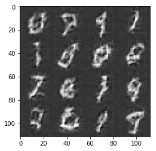


    Epoch 2/2... Discriminator Loss: 0.0742... Generator Loss: 3.0683
    Epoch 2/2... Discriminator Loss: 0.0955... Generator Loss: 2.8897
    Epoch 2/2... Discriminator Loss: 0.1669... Generator Loss: 2.3064
    Epoch 2/2... Discriminator Loss: 0.0441... Generator Loss: 4.3068
    Epoch 2/2... Discriminator Loss: 0.0332... Generator Loss: 4.2789
    Epoch 2/2... Discriminator Loss: 0.0907... Generator Loss: 2.8883
    Epoch 2/2... Discriminator Loss: 0.0950... Generator Loss: 3.1311
    Epoch 2/2... Discriminator Loss: 0.0553... Generator Loss: 3.6349
    Epoch 2/2... Discriminator Loss: 0.0326... Generator Loss: 4.4939
    Epoch 2/2... Discriminator Loss: 0.0510... Generator Loss: 3.8740
    Epoch 2/2... Discriminator Loss: 1.4186... Generator Loss: 0.5283
    Epoch 2/2... Discriminator Loss: 1.3896... Generator Loss: 2.1159
    Epoch 2/2... Discriminator Loss: 0.8684... Generator Loss: 0.8551
    Epoch 2/2... Discriminator Loss: 0.7854... Generator Loss: 1.3734
    Epoch 2/2... Discriminator Loss: 1.3995... Generator Loss: 0.3870
    Epoch 2/2... Discriminator Loss: 0.9185... Generator Loss: 0.7047
    Epoch 2/2... Discriminator Loss: 1.1011... Generator Loss: 0.5542
    Epoch 2/2... Discriminator Loss: 0.3647... Generator Loss: 2.0854
    Epoch 2/2... Discriminator Loss: 0.3502... Generator Loss: 2.4006
    Epoch 2/2... Discriminator Loss: 0.3350... Generator Loss: 1.5888


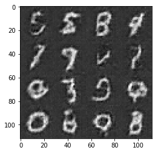


    Epoch 2/2... Discriminator Loss: 0.5007... Generator Loss: 2.2084
    Epoch 2/2... Discriminator Loss: 0.2693... Generator Loss: 1.8925
    Epoch 2/2... Discriminator Loss: 0.4326... Generator Loss: 1.3637
    Epoch 2/2... Discriminator Loss: 0.1610... Generator Loss: 2.4552
    Epoch 2/2... Discriminator Loss: 0.1045... Generator Loss: 3.2119
    Epoch 2/2... Discriminator Loss: 0.2348... Generator Loss: 1.9030
    Epoch 2/2... Discriminator Loss: 0.1528... Generator Loss: 2.4812
    Epoch 2/2... Discriminator Loss: 0.1395... Generator Loss: 2.5322
    Epoch 2/2... Discriminator Loss: 0.0810... Generator Loss: 3.3387
    Epoch 2/2... Discriminator Loss: 0.0544... Generator Loss: 3.9607
    Epoch 2/2... Discriminator Loss: 0.2431... Generator Loss: 1.8547
    Epoch 2/2... Discriminator Loss: 0.1553... Generator Loss: 2.2300
    Epoch 2/2... Discriminator Loss: 0.0696... Generator Loss: 3.3583
    Epoch 2/2... Discriminator Loss: 0.1305... Generator Loss: 2.7086
    Epoch 2/2... Discriminator Loss: 0.0601... Generator Loss: 3.3390
    Epoch 2/2... Discriminator Loss: 0.0384... Generator Loss: 5.4308
    Epoch 2/2... Discriminator Loss: 0.0973... Generator Loss: 3.4497
    Epoch 2/2... Discriminator Loss: 0.0957... Generator Loss: 3.1587
    Epoch 2/2... Discriminator Loss: 0.0434... Generator Loss: 4.5863
    Epoch 2/2... Discriminator Loss: 0.2362... Generator Loss: 1.9740


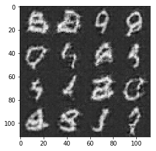


    Epoch 2/2... Discriminator Loss: 0.0622... Generator Loss: 3.6889
    Epoch 2/2... Discriminator Loss: 0.0291... Generator Loss: 4.5665
    Epoch 2/2... Discriminator Loss: 0.0707... Generator Loss: 4.2091
    Epoch 2/2... Discriminator Loss: 0.0431... Generator Loss: 4.1123
    Epoch 2/2... Discriminator Loss: 0.0625... Generator Loss: 3.4691
    Epoch 2/2... Discriminator Loss: 0.2782... Generator Loss: 2.2285
    Epoch 2/2... Discriminator Loss: 1.1453... Generator Loss: 1.5106
    Epoch 2/2... Discriminator Loss: 1.3975... Generator Loss: 0.3772
    Epoch 2/2... Discriminator Loss: 0.3300... Generator Loss: 2.0034
    Epoch 2/2... Discriminator Loss: 0.2346... Generator Loss: 1.8796
    Epoch 2/2... Discriminator Loss: 0.1832... Generator Loss: 2.3024
    Epoch 2/2... Discriminator Loss: 0.1752... Generator Loss: 2.3101
    Epoch 2/2... Discriminator Loss: 0.1229... Generator Loss: 2.7583
    Epoch 2/2... Discriminator Loss: 0.0522... Generator Loss: 3.7708
    Epoch 2/2... Discriminator Loss: 0.1924... Generator Loss: 2.1382
    Epoch 2/2... Discriminator Loss: 0.0410... Generator Loss: 4.6523
    Epoch 2/2... Discriminator Loss: 0.1564... Generator Loss: 2.2851
    Epoch 2/2... Discriminator Loss: 0.0652... Generator Loss: 5.3954
    Epoch 2/2... Discriminator Loss: 0.0434... Generator Loss: 4.5787
    Epoch 2/2... Discriminator Loss: 0.1387... Generator Loss: 2.4862


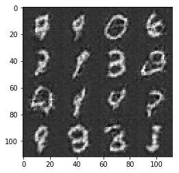


    Epoch 2/2... Discriminator Loss: 0.0325... Generator Loss: 4.4114
    Epoch 2/2... Discriminator Loss: 0.0664... Generator Loss: 3.3553
    Epoch 2/2... Discriminator Loss: 0.0648... Generator Loss: 3.5446
    Epoch 2/2... Discriminator Loss: 0.1199... Generator Loss: 2.6992
    Epoch 2/2... Discriminator Loss: 0.1160... Generator Loss: 2.7582
    Epoch 2/2... Discriminator Loss: 0.0804... Generator Loss: 3.1402
    Epoch 2/2... Discriminator Loss: 0.1676... Generator Loss: 2.2044
    Final Output:


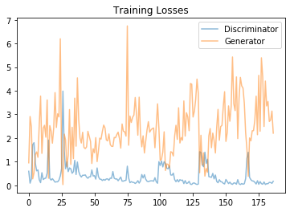


### CelebA
Run your GANs on CelebA.  It will take around 20 minutes on the average GPU to run one epoch.  You can run the whole epoch or stop when it starts to generate realistic faces.


```python
batch_size = 64
z_dim = 100
learning_rate = 0.0001
beta1 = 0.5


"""
DON'T MODIFY ANYTHING IN THIS CELL THAT IS BELOW THIS LINE
"""
epochs = 1

celeba_dataset = helper.Dataset('celeba', glob(os.path.join(data_dir, 'img_align_celeba/*.jpg')))
with tf.Graph().as_default():
    train(epochs, batch_size, z_dim, learning_rate, beta1, celeba_dataset.get_batches,
          celeba_dataset.shape, celeba_dataset.image_mode)
```

    Epoch 1/1... Discriminator Loss: 1.0787... Generator Loss: 0.7354
    Epoch 1/1... Discriminator Loss: 0.3811... Generator Loss: 1.5513
    Epoch 1/1... Discriminator Loss: 0.6003... Generator Loss: 1.4038
    Epoch 1/1... Discriminator Loss: 0.3469... Generator Loss: 1.8667
    Epoch 1/1... Discriminator Loss: 0.4604... Generator Loss: 1.9376
    Epoch 1/1... Discriminator Loss: 0.5888... Generator Loss: 1.7896
    Epoch 1/1... Discriminator Loss: 0.4025... Generator Loss: 1.9917
    Epoch 1/1... Discriminator Loss: 0.6704... Generator Loss: 1.5169
    Epoch 1/1... Discriminator Loss: 0.8293... Generator Loss: 0.9817
    Epoch 1/1... Discriminator Loss: 0.8643... Generator Loss: 1.0824
    Epoch 1/1... Discriminator Loss: 0.6538... Generator Loss: 1.1667
    Epoch 1/1... Discriminator Loss: 0.5465... Generator Loss: 1.6185
    Epoch 1/1... Discriminator Loss: 0.8475... Generator Loss: 2.8278
    Epoch 1/1... Discriminator Loss: 0.6239... Generator Loss: 1.2312
    Epoch 1/1... Discriminator Loss: 0.7129... Generator Loss: 1.0148
    Epoch 1/1... Discriminator Loss: 0.5592... Generator Loss: 1.5430
    Epoch 1/1... Discriminator Loss: 0.5357... Generator Loss: 1.4755
    Epoch 1/1... Discriminator Loss: 0.6852... Generator Loss: 1.2114
    Epoch 1/1... Discriminator Loss: 1.1192... Generator Loss: 0.5742
    Epoch 1/1... Discriminator Loss: 1.7269... Generator Loss: 0.2562


    Epoch 1/1... Discriminator Loss: 1.4012... Generator Loss: 2.0186
    Epoch 1/1... Discriminator Loss: 1.1926... Generator Loss: 0.9787
    Epoch 1/1... Discriminator Loss: 1.8067... Generator Loss: 0.3768
    Epoch 1/1... Discriminator Loss: 1.0887... Generator Loss: 0.9463
    Epoch 1/1... Discriminator Loss: 1.2506... Generator Loss: 1.0557
    Epoch 1/1... Discriminator Loss: 1.1764... Generator Loss: 0.7528
    Epoch 1/1... Discriminator Loss: 0.8959... Generator Loss: 0.9418
    Epoch 1/1... Discriminator Loss: 1.1383... Generator Loss: 0.8688
    Epoch 1/1... Discriminator Loss: 0.8009... Generator Loss: 1.3366
    Epoch 1/1... Discriminator Loss: 1.2705... Generator Loss: 1.0337
    Epoch 1/1... Discriminator Loss: 0.9230... Generator Loss: 1.2146
    Epoch 1/1... Discriminator Loss: 0.8282... Generator Loss: 1.3228
    Epoch 1/1... Discriminator Loss: 1.0807... Generator Loss: 1.2157
    Epoch 1/1... Discriminator Loss: 1.2898... Generator Loss: 0.8129
    Epoch 1/1... Discriminator Loss: 0.9793... Generator Loss: 1.0631
    Epoch 1/1... Discriminator Loss: 1.1930... Generator Loss: 0.9513
    Epoch 1/1... Discriminator Loss: 1.4646... Generator Loss: 0.9660
    Epoch 1/1... Discriminator Loss: 1.1591... Generator Loss: 1.0491
    Epoch 1/1... Discriminator Loss: 1.2060... Generator Loss: 0.7532
    Epoch 1/1... Discriminator Loss: 1.2636... Generator Loss: 1.0138


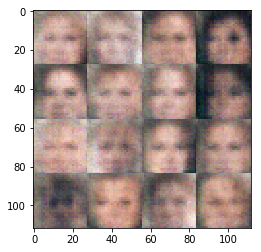


    Epoch 1/1... Discriminator Loss: 1.2598... Generator Loss: 0.7686
    Epoch 1/1... Discriminator Loss: 1.0342... Generator Loss: 1.0615
    Epoch 1/1... Discriminator Loss: 1.2727... Generator Loss: 0.6555
    Epoch 1/1... Discriminator Loss: 1.3084... Generator Loss: 0.6570
    Epoch 1/1... Discriminator Loss: 1.1292... Generator Loss: 0.9234
    Epoch 1/1... Discriminator Loss: 1.0287... Generator Loss: 1.0032
    Epoch 1/1... Discriminator Loss: 1.2011... Generator Loss: 0.8888
    Epoch 1/1... Discriminator Loss: 1.1961... Generator Loss: 0.6726
    Epoch 1/1... Discriminator Loss: 1.2367... Generator Loss: 1.1893
    Epoch 1/1... Discriminator Loss: 0.9703... Generator Loss: 1.0517
    Epoch 1/1... Discriminator Loss: 1.0835... Generator Loss: 1.1093
    Epoch 1/1... Discriminator Loss: 1.1434... Generator Loss: 0.7453
    Epoch 1/1... Discriminator Loss: 1.4652... Generator Loss: 0.4388
    Epoch 1/1... Discriminator Loss: 1.0178... Generator Loss: 0.9214
    Epoch 1/1... Discriminator Loss: 1.1157... Generator Loss: 0.8906
    Epoch 1/1... Discriminator Loss: 1.0407... Generator Loss: 1.3738
    Epoch 1/1... Discriminator Loss: 1.2428... Generator Loss: 0.7205
    Epoch 1/1... Discriminator Loss: 1.0358... Generator Loss: 0.9110
    Epoch 1/1... Discriminator Loss: 1.0422... Generator Loss: 1.3370
    Epoch 1/1... Discriminator Loss: 0.8366... Generator Loss: 1.1514


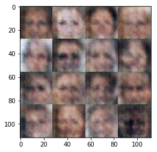


    Epoch 1/1... Discriminator Loss: 0.7795... Generator Loss: 1.6357
    Epoch 1/1... Discriminator Loss: 0.9932... Generator Loss: 0.8391
    Epoch 1/1... Discriminator Loss: 0.8388... Generator Loss: 1.2721
    Epoch 1/1... Discriminator Loss: 1.2042... Generator Loss: 2.1640
    Epoch 1/1... Discriminator Loss: 0.8437... Generator Loss: 1.0523
    Epoch 1/1... Discriminator Loss: 0.9771... Generator Loss: 1.0174
    Epoch 1/1... Discriminator Loss: 0.9937... Generator Loss: 1.0045
    Epoch 1/1... Discriminator Loss: 1.0755... Generator Loss: 0.6925
    Epoch 1/1... Discriminator Loss: 0.9999... Generator Loss: 0.8028
    Epoch 1/1... Discriminator Loss: 0.9884... Generator Loss: 0.7315
    Epoch 1/1... Discriminator Loss: 0.8834... Generator Loss: 1.1354
    Epoch 1/1... Discriminator Loss: 1.0535... Generator Loss: 0.9906
    Epoch 1/1... Discriminator Loss: 1.2064... Generator Loss: 0.6126
    Epoch 1/1... Discriminator Loss: 1.0510... Generator Loss: 0.7815
    Epoch 1/1... Discriminator Loss: 0.8489... Generator Loss: 1.2576
    Epoch 1/1... Discriminator Loss: 1.0683... Generator Loss: 0.9297
    Epoch 1/1... Discriminator Loss: 0.9771... Generator Loss: 1.8613
    Epoch 1/1... Discriminator Loss: 1.2467... Generator Loss: 0.5572
    Epoch 1/1... Discriminator Loss: 0.9427... Generator Loss: 1.4107
    Epoch 1/1... Discriminator Loss: 0.9634... Generator Loss: 0.8731


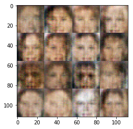


    Epoch 1/1... Discriminator Loss: 0.7983... Generator Loss: 1.6803
    Epoch 1/1... Discriminator Loss: 1.0328... Generator Loss: 0.9491
    Epoch 1/1... Discriminator Loss: 1.0559... Generator Loss: 1.0675
    Epoch 1/1... Discriminator Loss: 1.0115... Generator Loss: 1.0417
    Epoch 1/1... Discriminator Loss: 1.0371... Generator Loss: 0.7960
    Epoch 1/1... Discriminator Loss: 1.1448... Generator Loss: 0.6399
    Epoch 1/1... Discriminator Loss: 1.1270... Generator Loss: 0.6680
    Epoch 1/1... Discriminator Loss: 0.9548... Generator Loss: 0.9071
    Epoch 1/1... Discriminator Loss: 0.8547... Generator Loss: 1.3669
    Epoch 1/1... Discriminator Loss: 0.9620... Generator Loss: 0.8140
    Epoch 1/1... Discriminator Loss: 1.0317... Generator Loss: 0.8830
    Epoch 1/1... Discriminator Loss: 0.9998... Generator Loss: 0.8867
    Epoch 1/1... Discriminator Loss: 1.3186... Generator Loss: 0.4527
    Epoch 1/1... Discriminator Loss: 0.9282... Generator Loss: 0.7128
    Epoch 1/1... Discriminator Loss: 0.8882... Generator Loss: 0.9772
    Epoch 1/1... Discriminator Loss: 1.1698... Generator Loss: 0.5936
    Epoch 1/1... Discriminator Loss: 1.0205... Generator Loss: 0.6426
    Epoch 1/1... Discriminator Loss: 1.0111... Generator Loss: 0.8340
    Epoch 1/1... Discriminator Loss: 1.2946... Generator Loss: 0.4834
    Epoch 1/1... Discriminator Loss: 1.2377... Generator Loss: 0.5383


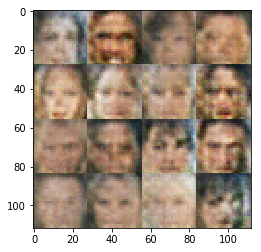


    Epoch 1/1... Discriminator Loss: 1.1864... Generator Loss: 1.6851
    Epoch 1/1... Discriminator Loss: 1.1700... Generator Loss: 0.7778
    Epoch 1/1... Discriminator Loss: 1.0071... Generator Loss: 1.4856
    Epoch 1/1... Discriminator Loss: 0.7268... Generator Loss: 1.9494
    Epoch 1/1... Discriminator Loss: 0.9740... Generator Loss: 1.3931
    Epoch 1/1... Discriminator Loss: 1.0170... Generator Loss: 1.4441
    Epoch 1/1... Discriminator Loss: 1.0059... Generator Loss: 1.8813
    Epoch 1/1... Discriminator Loss: 0.9041... Generator Loss: 1.4490
    Epoch 1/1... Discriminator Loss: 1.0912... Generator Loss: 0.7900
    Epoch 1/1... Discriminator Loss: 0.9003... Generator Loss: 1.2326
    Epoch 1/1... Discriminator Loss: 1.1263... Generator Loss: 1.0524
    Epoch 1/1... Discriminator Loss: 1.0477... Generator Loss: 0.8413
    Epoch 1/1... Discriminator Loss: 0.8976... Generator Loss: 0.9048
    Epoch 1/1... Discriminator Loss: 0.9357... Generator Loss: 1.1269
    Epoch 1/1... Discriminator Loss: 1.2052... Generator Loss: 0.6249
    Epoch 1/1... Discriminator Loss: 0.8308... Generator Loss: 1.2524
    Epoch 1/1... Discriminator Loss: 1.0092... Generator Loss: 0.9338
    Epoch 1/1... Discriminator Loss: 1.1062... Generator Loss: 0.7524
    Epoch 1/1... Discriminator Loss: 0.9822... Generator Loss: 0.7199
    Epoch 1/1... Discriminator Loss: 1.0328... Generator Loss: 0.8949


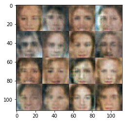


    Epoch 1/1... Discriminator Loss: 0.9835... Generator Loss: 0.9314
    Epoch 1/1... Discriminator Loss: 0.9810... Generator Loss: 0.9926
    Epoch 1/1... Discriminator Loss: 0.9130... Generator Loss: 1.2731
    Epoch 1/1... Discriminator Loss: 1.0471... Generator Loss: 0.8901
    Epoch 1/1... Discriminator Loss: 1.0857... Generator Loss: 0.7501
    Epoch 1/1... Discriminator Loss: 1.2111... Generator Loss: 0.6975
    Epoch 1/1... Discriminator Loss: 0.8283... Generator Loss: 1.2872
    Epoch 1/1... Discriminator Loss: 1.1155... Generator Loss: 0.7171
    Epoch 1/1... Discriminator Loss: 1.1092... Generator Loss: 0.7590
    Epoch 1/1... Discriminator Loss: 1.0546... Generator Loss: 0.8753
    Epoch 1/1... Discriminator Loss: 1.0223... Generator Loss: 0.6473
    Epoch 1/1... Discriminator Loss: 1.0553... Generator Loss: 1.0147
    Epoch 1/1... Discriminator Loss: 0.7625... Generator Loss: 1.5841
    Epoch 1/1... Discriminator Loss: 1.1919... Generator Loss: 0.5762
    Epoch 1/1... Discriminator Loss: 0.8063... Generator Loss: 1.2663
    Epoch 1/1... Discriminator Loss: 1.0735... Generator Loss: 1.0821
    Epoch 1/1... Discriminator Loss: 0.8455... Generator Loss: 0.8591
    Epoch 1/1... Discriminator Loss: 1.1269... Generator Loss: 0.7775
    Epoch 1/1... Discriminator Loss: 1.1192... Generator Loss: 0.5551
    Epoch 1/1... Discriminator Loss: 0.9849... Generator Loss: 1.4034


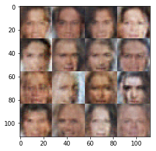


    Epoch 1/1... Discriminator Loss: 0.9434... Generator Loss: 0.9274
    Epoch 1/1... Discriminator Loss: 1.0174... Generator Loss: 0.8329
    Epoch 1/1... Discriminator Loss: 0.9717... Generator Loss: 0.8716
    Epoch 1/1... Discriminator Loss: 1.0780... Generator Loss: 1.1016
    Epoch 1/1... Discriminator Loss: 0.9798... Generator Loss: 0.8022
    Epoch 1/1... Discriminator Loss: 1.1287... Generator Loss: 0.7683
    Epoch 1/1... Discriminator Loss: 0.8943... Generator Loss: 1.2174
    Epoch 1/1... Discriminator Loss: 1.4536... Generator Loss: 0.3500
    Epoch 1/1... Discriminator Loss: 1.2461... Generator Loss: 0.5611
    Epoch 1/1... Discriminator Loss: 0.9302... Generator Loss: 1.0843
    Epoch 1/1... Discriminator Loss: 1.2654... Generator Loss: 0.4636
    Epoch 1/1... Discriminator Loss: 0.7296... Generator Loss: 1.2723
    Epoch 1/1... Discriminator Loss: 1.0188... Generator Loss: 0.9150
    Epoch 1/1... Discriminator Loss: 0.6704... Generator Loss: 1.3153
    Epoch 1/1... Discriminator Loss: 1.0375... Generator Loss: 0.7100
    Epoch 1/1... Discriminator Loss: 0.8968... Generator Loss: 0.8814
    Epoch 1/1... Discriminator Loss: 0.7209... Generator Loss: 1.2542
    Epoch 1/1... Discriminator Loss: 1.0226... Generator Loss: 0.7476
    Epoch 1/1... Discriminator Loss: 0.7777... Generator Loss: 1.0891
    Epoch 1/1... Discriminator Loss: 1.0072... Generator Loss: 0.9785


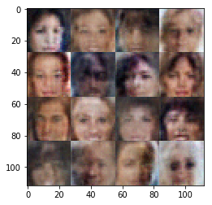


    Epoch 1/1... Discriminator Loss: 1.3099... Generator Loss: 0.5190
    Epoch 1/1... Discriminator Loss: 1.2375... Generator Loss: 0.5783
    Epoch 1/1... Discriminator Loss: 0.8715... Generator Loss: 1.6594
    Epoch 1/1... Discriminator Loss: 0.8369... Generator Loss: 1.4759
    Epoch 1/1... Discriminator Loss: 0.8600... Generator Loss: 0.9818
    Epoch 1/1... Discriminator Loss: 0.8596... Generator Loss: 0.8691
    Epoch 1/1... Discriminator Loss: 0.7406... Generator Loss: 1.3630
    Epoch 1/1... Discriminator Loss: 1.0331... Generator Loss: 1.0463
    Epoch 1/1... Discriminator Loss: 0.8211... Generator Loss: 1.2103
    Epoch 1/1... Discriminator Loss: 1.0670... Generator Loss: 0.6368
    Epoch 1/1... Discriminator Loss: 2.0500... Generator Loss: 0.1833
    Epoch 1/1... Discriminator Loss: 0.5669... Generator Loss: 1.6304
    Epoch 1/1... Discriminator Loss: 1.0878... Generator Loss: 0.6092
    Epoch 1/1... Discriminator Loss: 1.0731... Generator Loss: 0.8132
    Epoch 1/1... Discriminator Loss: 0.6046... Generator Loss: 1.8055
    Epoch 1/1... Discriminator Loss: 1.5983... Generator Loss: 0.3110
    Epoch 1/1... Discriminator Loss: 0.8892... Generator Loss: 0.9431
    Epoch 1/1... Discriminator Loss: 0.9812... Generator Loss: 0.7861
    Epoch 1/1... Discriminator Loss: 0.8218... Generator Loss: 0.9292
    Epoch 1/1... Discriminator Loss: 0.8391... Generator Loss: 1.2271


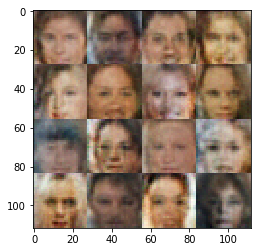


    Epoch 1/1... Discriminator Loss: 0.5016... Generator Loss: 2.6425
    Epoch 1/1... Discriminator Loss: 0.3669... Generator Loss: 1.9433
    Epoch 1/1... Discriminator Loss: 0.5097... Generator Loss: 1.2384
    Epoch 1/1... Discriminator Loss: 0.4299... Generator Loss: 1.9240
    Epoch 1/1... Discriminator Loss: 0.5124... Generator Loss: 1.9214
    Epoch 1/1... Discriminator Loss: 0.5680... Generator Loss: 3.8879
    Epoch 1/1... Discriminator Loss: 0.3082... Generator Loss: 3.0163
    Epoch 1/1... Discriminator Loss: 0.9449... Generator Loss: 3.8796
    Epoch 1/1... Discriminator Loss: 0.2405... Generator Loss: 3.8547
    Epoch 1/1... Discriminator Loss: 0.8447... Generator Loss: 0.7042
    Epoch 1/1... Discriminator Loss: 0.2618... Generator Loss: 2.3295
    Epoch 1/1... Discriminator Loss: 0.5288... Generator Loss: 6.8924
    Epoch 1/1... Discriminator Loss: 0.4882... Generator Loss: 1.9575
    Epoch 1/1... Discriminator Loss: 1.8379... Generator Loss: 0.2197
    Epoch 1/1... Discriminator Loss: 0.2948... Generator Loss: 2.6013
    Epoch 1/1... Discriminator Loss: 0.5093... Generator Loss: 1.3425
    Epoch 1/1... Discriminator Loss: 0.4270... Generator Loss: 3.9522
    Epoch 1/1... Discriminator Loss: 0.3672... Generator Loss: 4.8644
    Epoch 1/1... Discriminator Loss: 0.4548... Generator Loss: 1.2782
    Epoch 1/1... Discriminator Loss: 1.5673... Generator Loss: 0.2824


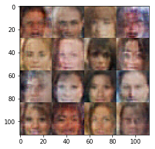


    Epoch 1/1... Discriminator Loss: 0.1090... Generator Loss: 6.6119
    Epoch 1/1... Discriminator Loss: 0.1103... Generator Loss: 7.7421
    Epoch 1/1... Discriminator Loss: 0.2869... Generator Loss: 1.7713
    Epoch 1/1... Discriminator Loss: 0.4250... Generator Loss: 1.6047
    Epoch 1/1... Discriminator Loss: 0.1167... Generator Loss: 6.8645
    Epoch 1/1... Discriminator Loss: 0.4803... Generator Loss: 6.8999
    Epoch 1/1... Discriminator Loss: 0.4565... Generator Loss: 8.3684
    Epoch 1/1... Discriminator Loss: 0.3572... Generator Loss: 1.6030
    Epoch 1/1... Discriminator Loss: 0.0815... Generator Loss: 4.5758
    Epoch 1/1... Discriminator Loss: 0.1312... Generator Loss: 2.7381
    Epoch 1/1... Discriminator Loss: 0.3064... Generator Loss: 6.0601
    Epoch 1/1... Discriminator Loss: 0.0575... Generator Loss: 7.8544
    Epoch 1/1... Discriminator Loss: 4.4050... Generator Loss: 0.0264
    Epoch 1/1... Discriminator Loss: 0.0777... Generator Loss: 4.4097
    Epoch 1/1... Discriminator Loss: 0.0636... Generator Loss: 4.6504
    Epoch 1/1... Discriminator Loss: 0.1321... Generator Loss: 6.3385
    Epoch 1/1... Discriminator Loss: 0.3024... Generator Loss: 3.8265
    Epoch 1/1... Discriminator Loss: 0.1069... Generator Loss: 3.2207
    Epoch 1/1... Discriminator Loss: 0.2240... Generator Loss: 1.9281
    Epoch 1/1... Discriminator Loss: 0.1863... Generator Loss: 4.8980


    Epoch 1/1... Discriminator Loss: 0.5229... Generator Loss: 1.3125
    Epoch 1/1... Discriminator Loss: 0.0392... Generator Loss: 6.3415
    Epoch 1/1... Discriminator Loss: 0.9721... Generator Loss: 10.6382
    Epoch 1/1... Discriminator Loss: 0.4657... Generator Loss: 10.0167
    Epoch 1/1... Discriminator Loss: 0.9134... Generator Loss: 6.9977
    Epoch 1/1... Discriminator Loss: 0.2085... Generator Loss: 3.2611
    Epoch 1/1... Discriminator Loss: 0.3094... Generator Loss: 7.9027
    Epoch 1/1... Discriminator Loss: 0.0514... Generator Loss: 4.1128
    Epoch 1/1... Discriminator Loss: 0.2824... Generator Loss: 1.7601
    Epoch 1/1... Discriminator Loss: 0.1236... Generator Loss: 3.3940
    Epoch 1/1... Discriminator Loss: 0.1432... Generator Loss: 4.2430
    Epoch 1/1... Discriminator Loss: 0.2675... Generator Loss: 8.7825
    Epoch 1/1... Discriminator Loss: 0.7361... Generator Loss: 4.2236
    Epoch 1/1... Discriminator Loss: 0.1786... Generator Loss: 3.5860
    Epoch 1/1... Discriminator Loss: 0.3257... Generator Loss: 1.9654
    Epoch 1/1... Discriminator Loss: 0.1515... Generator Loss: 2.8318
    Epoch 1/1... Discriminator Loss: 0.0604... Generator Loss: 5.6983
    Epoch 1/1... Discriminator Loss: 0.2828... Generator Loss: 3.0368
    Epoch 1/1... Discriminator Loss: 0.1481... Generator Loss: 7.6440
    Epoch 1/1... Discriminator Loss: 0.3133... Generator Loss: 1.8533


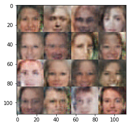


    Epoch 1/1... Discriminator Loss: 0.2057... Generator Loss: 4.0448
    Epoch 1/1... Discriminator Loss: 0.1843... Generator Loss: 3.4583
    Epoch 1/1... Discriminator Loss: 0.1571... Generator Loss: 2.6364
    Epoch 1/1... Discriminator Loss: 0.1043... Generator Loss: 2.8426
    Epoch 1/1... Discriminator Loss: 0.1002... Generator Loss: 3.6394
    Epoch 1/1... Discriminator Loss: 0.0700... Generator Loss: 5.2060
    Epoch 1/1... Discriminator Loss: 0.0802... Generator Loss: 4.9699
    Epoch 1/1... Discriminator Loss: 0.2577... Generator Loss: 1.8977
    Epoch 1/1... Discriminator Loss: 0.0781... Generator Loss: 4.7391
    Epoch 1/1... Discriminator Loss: 0.5778... Generator Loss: 1.0017
    Epoch 1/1... Discriminator Loss: 0.5841... Generator Loss: 1.0536
    Epoch 1/1... Discriminator Loss: 0.1311... Generator Loss: 10.6966
    Epoch 1/1... Discriminator Loss: 0.4827... Generator Loss: 1.2451
    Epoch 1/1... Discriminator Loss: 0.2134... Generator Loss: 6.9588
    Epoch 1/1... Discriminator Loss: 0.4567... Generator Loss: 7.5079
    Epoch 1/1... Discriminator Loss: 0.8310... Generator Loss: 0.6926
    Epoch 1/1... Discriminator Loss: 3.1332... Generator Loss: 0.0673
    Epoch 1/1... Discriminator Loss: 0.5708... Generator Loss: 1.0502
    Epoch 1/1... Discriminator Loss: 0.0739... Generator Loss: 6.2352
    Epoch 1/1... Discriminator Loss: 1.0859... Generator Loss: 0.5030


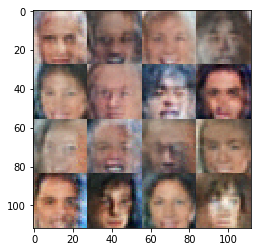


    Epoch 1/1... Discriminator Loss: 0.4586... Generator Loss: 6.0855
    Epoch 1/1... Discriminator Loss: 0.4071... Generator Loss: 1.8421
    Epoch 1/1... Discriminator Loss: 0.4579... Generator Loss: 1.3925
    Epoch 1/1... Discriminator Loss: 0.1504... Generator Loss: 2.4008
    Epoch 1/1... Discriminator Loss: 0.2988... Generator Loss: 1.8238
    Epoch 1/1... Discriminator Loss: 0.4831... Generator Loss: 1.2602
    Epoch 1/1... Discriminator Loss: 0.0793... Generator Loss: 4.5628
    Epoch 1/1... Discriminator Loss: 1.0211... Generator Loss: 0.5308
    Epoch 1/1... Discriminator Loss: 0.0791... Generator Loss: 3.2835
    Epoch 1/1... Discriminator Loss: 0.1195... Generator Loss: 4.6187
    Epoch 1/1... Discriminator Loss: 0.1700... Generator Loss: 2.3934
    Epoch 1/1... Discriminator Loss: 0.2372... Generator Loss: 2.8378
    Epoch 1/1... Discriminator Loss: 0.4411... Generator Loss: 1.3716
    Epoch 1/1... Discriminator Loss: 0.1094... Generator Loss: 2.9476
    Epoch 1/1... Discriminator Loss: 1.2689... Generator Loss: 0.4004
    Epoch 1/1... Discriminator Loss: 0.1384... Generator Loss: 3.3907
    Epoch 1/1... Discriminator Loss: 0.0476... Generator Loss: 4.1405
    Epoch 1/1... Discriminator Loss: 0.4079... Generator Loss: 1.3351
    Epoch 1/1... Discriminator Loss: 0.1203... Generator Loss: 5.0337
    Epoch 1/1... Discriminator Loss: 0.0406... Generator Loss: 8.4063


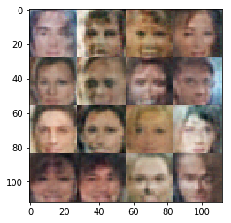


    Epoch 1/1... Discriminator Loss: 0.1737... Generator Loss: 4.7458
    Epoch 1/1... Discriminator Loss: 0.2214... Generator Loss: 2.2010
    Epoch 1/1... Discriminator Loss: 0.2662... Generator Loss: 2.4186
    Epoch 1/1... Discriminator Loss: 0.7732... Generator Loss: 6.8237
    Epoch 1/1... Discriminator Loss: 0.4897... Generator Loss: 9.3572
    Epoch 1/1... Discriminator Loss: 0.4183... Generator Loss: 1.5048
    Epoch 1/1... Discriminator Loss: 0.6632... Generator Loss: 0.9840
    Epoch 1/1... Discriminator Loss: 0.7308... Generator Loss: 0.9160
    Epoch 1/1... Discriminator Loss: 0.4523... Generator Loss: 1.2566
    Epoch 1/1... Discriminator Loss: 0.2619... Generator Loss: 6.3648
    Epoch 1/1... Discriminator Loss: 0.0984... Generator Loss: 4.6205
    Epoch 1/1... Discriminator Loss: 0.6790... Generator Loss: 1.0012
    Epoch 1/1... Discriminator Loss: 0.1057... Generator Loss: 3.8846
    Epoch 1/1... Discriminator Loss: 2.3512... Generator Loss: 5.6855
    Epoch 1/1... Discriminator Loss: 0.3553... Generator Loss: 3.8798
    Epoch 1/1... Discriminator Loss: 0.4917... Generator Loss: 1.6896
    Epoch 1/1... Discriminator Loss: 0.9654... Generator Loss: 0.5454
    Epoch 1/1... Discriminator Loss: 0.0455... Generator Loss: 4.8136
    Epoch 1/1... Discriminator Loss: 0.1586... Generator Loss: 4.8738
    Epoch 1/1... Discriminator Loss: 0.3930... Generator Loss: 1.4398


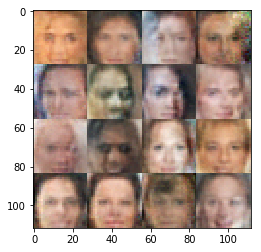


    Epoch 1/1... Discriminator Loss: 0.2143... Generator Loss: 7.2359
    Epoch 1/1... Discriminator Loss: 0.2886... Generator Loss: 2.1182
    Epoch 1/1... Discriminator Loss: 0.3088... Generator Loss: 1.9370
    Epoch 1/1... Discriminator Loss: 0.3312... Generator Loss: 6.3462
    Epoch 1/1... Discriminator Loss: 0.2473... Generator Loss: 2.0946
    Epoch 1/1... Discriminator Loss: 0.1280... Generator Loss: 6.1693
    Epoch 1/1... Discriminator Loss: 0.2399... Generator Loss: 2.8564
    Epoch 1/1... Discriminator Loss: 0.5509... Generator Loss: 3.8730
    Epoch 1/1... Discriminator Loss: 0.1867... Generator Loss: 2.9805
    Epoch 1/1... Discriminator Loss: 0.1409... Generator Loss: 2.9631
    Epoch 1/1... Discriminator Loss: 0.0687... Generator Loss: 4.5306
    Epoch 1/1... Discriminator Loss: 0.0300... Generator Loss: 7.4832
    Epoch 1/1... Discriminator Loss: 0.6967... Generator Loss: 0.9207
    Epoch 1/1... Discriminator Loss: 0.4624... Generator Loss: 1.4274
    Epoch 1/1... Discriminator Loss: 0.2408... Generator Loss: 9.9021
    Epoch 1/1... Discriminator Loss: 0.5846... Generator Loss: 1.8722
    Final Output:


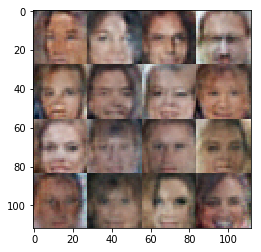


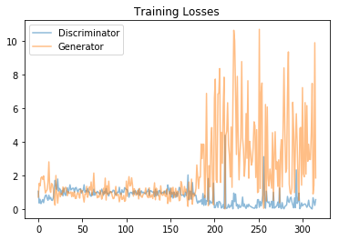

